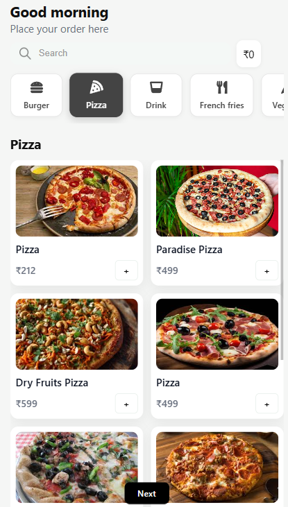
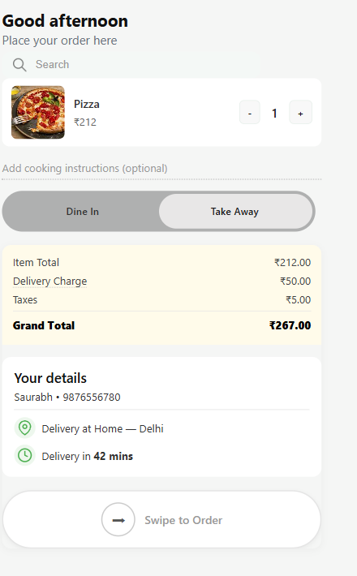
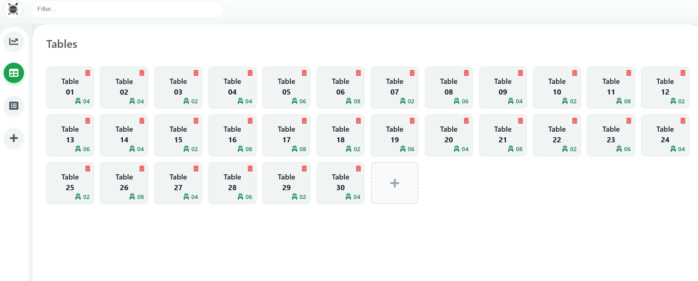

# Restaurant-Management-System

A full-stack Restaurant Management & User Ordering System built using the MERN Stack (MongoDB, Express.js, React.js, Node.js).

This app has two main sections:

1. Restaurant Admin Dashboard – Manage orders, tables, chefs, menu items, and view analytics.

2. User App – Browse menu, add to cart, checkout (Dine In / Takeaway), and place orders.

The project consists of:

1. Backend: Node.js, Express.js, MongoDB

2. Frontend (User App): React.js (for customers)

3. Frontend (Admin Panel): React.js (for restaurant staff/admins)

# Live Links

1. Backend (Render):
🔗 https://restaurant-management-system-backend-8ku8.onrender.com

2. User App (Vercel):
🔗 https://restaurant-user-app.vercel.app

3. Admin App (Vercel):
🔗 https://restaurant-admin.vercel.app

# BACKEND SETUP

Folder: backend

# 1. Installation Commands

1. cd backend
2. npm init -y
3. npm install express mongoose cors dotenv morgan
4. npm install nodemon --save-dev

# Folder Structure

backend/
│
├── config/
│   └── db.js
│
├── controllers/
│   ├── analyticsController.js
│   ├── chefController.js
│   ├── menuController.js
│   ├── orderController.js
│   └── tableController.js
│
├── models/
│   ├── chefModel.js
│   ├── menuModel.js
│   ├── orderModel.js
│   └── tableModel.js
│
├── routes/
│   ├── analyticsRoutes.js
│   ├── chefRoutes.js
│   ├── menuRoutes.js
│   ├── orderRoutes.js
│   └── tableRoutes.js
│
├── server.js
└── .env

# 4. Start Script

Add this line in your package.json:

"scripts": {
    "start": "node server.js",
    "dev": "nodemon server.js"
  },

# 5. Run Server
npm run dev

# 6. API Endpoints Overview

| Endpoint                 | Method      | Description                    |
| -----------------        | ------      | ------------------------------ |
| `/api/orders`            | GET         | Get all orders                 |
| `/api/orders`            | POST        | Create a new order             |
| `/api/orders/:id`        | PATCH       | Update order status            |
| `/api/tables`            | GET         | Get all tables                 |
| `/api/tables`            | POST        | Add new table                  |
| `/api/tables/:id`        | DELETE      | Delete table (if not reserved) |
| `/api/chefs`             | GET         | Get all chefs                  |
| `/api/chefs`             | POST        | Add new chef                   |
| `/api/menu`              | GET         | Get all menu items             |
| `/api/menu`              | POST        | Add new menu item              |
| `/api/analytics`         | GET         | Get analytics overview         |

# 7 Features

1. RESTful API built with Express.js
2. MongoDB for data storage
3. Mongoose models for:
(a) Menu
(b) Orders
(c) Tables
(d) Users

4. CORS and Cookie support
5. Environment-based configuration
6. API routes integrated with frontend
7. Deployed on Render

# 8 Tech Stack

1. Node.js
2. Express.js
3. MongoDB
4. Mongoose
5. dotenv
6. cors
7. body-parser

# FRONTEND SETUP
Folder: frontend

# Restaurant Admin Frontend (Create React App)

# Installation :
1. npx create-react-app restaurant-admin
2. cd restaurant-admin
3. npm install axios react-router-dom react-toastify react-dnd react-dnd-html5-backend recharts

Start:
npm start

# Features

1. Admin dashboard for analytics and reports
2. Live revenue charts & daily orders fetched from backend
3. Manage tables and reservations
4. Track orders and chef performance
5. Secure Axios API configuration
6. Responsive and clean admin UI

# Tech Stack

1. React.js
2. Axios
3. Chart.js / Recharts
4. React Router
5. Vanilla CSS

Backend API base: http://localhost:5000/api

# FRONTEND (User App)
 Folder: frontend/user-app

# Installation Commands
1. cd frontend/user-app
2. npm install
3. npm start

# Build for Production
Build for Production

# Features

1. Browse menu items by category
2. Search food items
3. Add/remove multiple items to/from cart
4. Adjust item quantity individually
5. Dine-In or Take-Away order options
6. Cooking instructions modal
7. Swipe-to-Order feature
8. Responsive UI
9. Connected to backend API

# Tech Stack

1. React.js
2. React Router DOM
3. Axios
4. Context API
5. Vanilla CSS (modular)
6. LocalStorage for cart persistence

# Screenshots

# 1. (User)

# 2. (Restaurant Admin)

